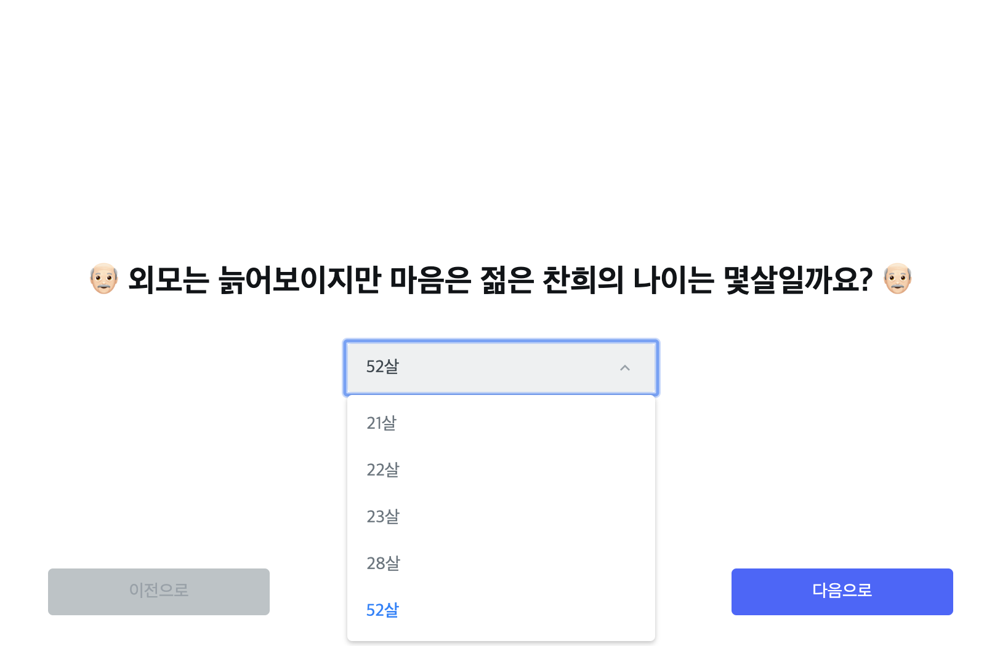
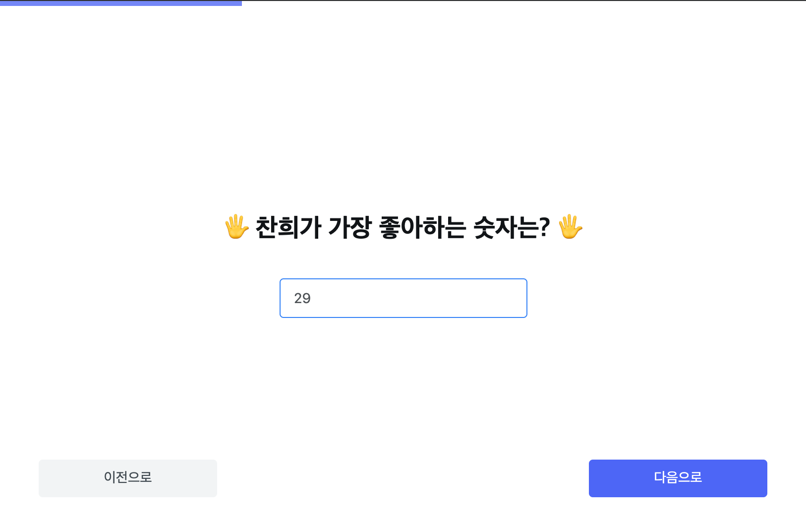
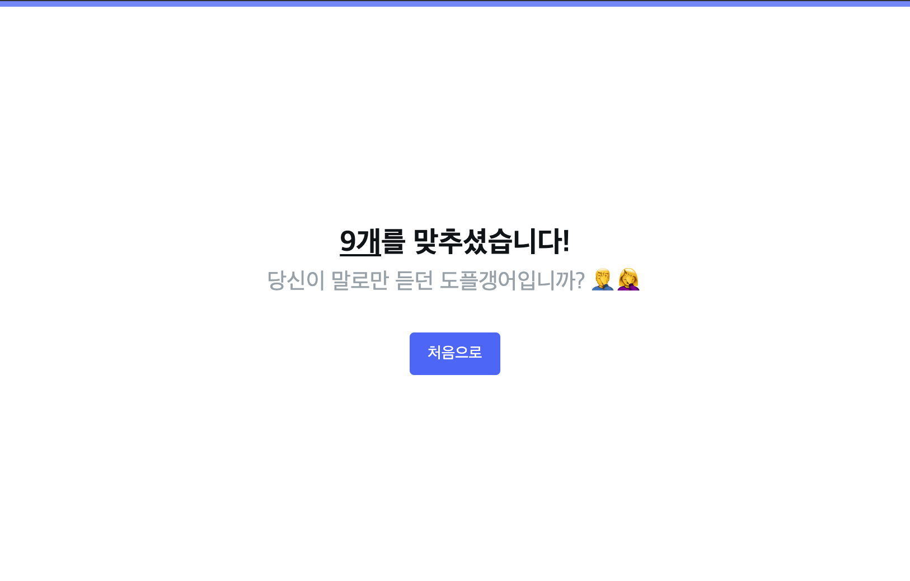

# 야매로! React 시작하기 (입문편)

## ⚠️ Disclamer

본 강의는 React 혹은 웹 자체를 처음 맛보는 분들에게 React, 넓게는 프론트엔드가 어떤 느낌으로 동작하는지 알아보는 것을 목적으로 합니다.

강의마다 참여자들의 학습 속도 및 상황, 그때 그때의 이야기에 따라 유동적으로 소스 코드의 퀄리티 및 주제가 변화합니다. 깔끔한 코드 및 정확한 로직보다는 '일단 돌아가는 것'만 집중하기에 양해 부탁드립니다.

React를 보다 자세히 학습하시기 위해서는 공식 문서를 참조하시기 바랍니다.
https://ko.reactjs.org

## 강의 기본 원칙

#### 언제나 그렇지만, 이렇게 배우면 안됩니다.

무엇을 하는지 정해져있지만, 준비된 강의자료도, 옳은 설명도 없습니다.  
각자 수업이 끝나고 나면 그 시간동안 배운 것을 돌아보고 맞는것 틀린것 점검하면서 **지식을 내 것으로 만드세요.**

#### 지식의 완전한 습득보다는 느낌만 잡습니다.

자바스크립트가 대체 어떻게 굴러가고, `.map`이 뭐고, `if()`가 무엇인지 세세하게 설명하지 않습니다.  
다만, 어떤 것이 어떤 느낌으로 동작하게 되는 것인지 말로 풀어서 설명합니다.

#### 만들면서 이해합니다.

이번 강의에는 아래와 같은 것을 만들게 됩니다.
본격 유 노우 미? (나를 아는지 테스트하는 사이트 만들기)
https://do-you-know-chanhee.surge.sh

